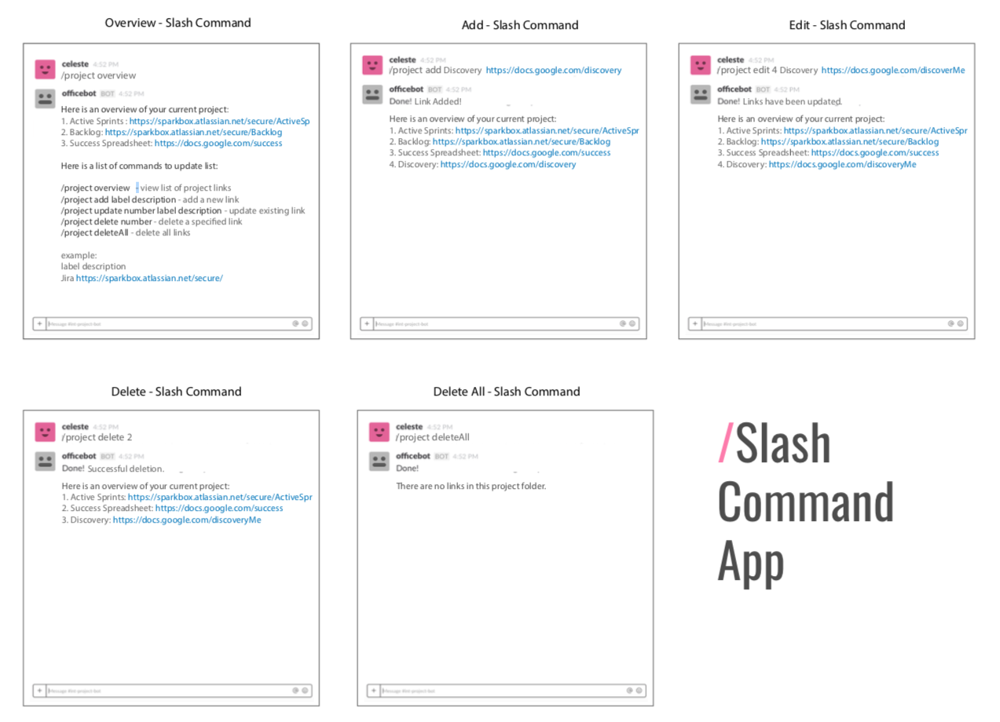

# SlackBot Project

**Team**: Project Manager, Technical Lead, 2 developer apprentices

## Mission:

The goal of this project is to provide Slack Users with information about a current
project. With a slash command, the bot will return requested information such as a
general overview or team information. Specific users will also be able to add and
delete specific information. See the image below to get a better understanding.

## End Goal

### Knex Configuration:
In order for your Knex migrations to function correctly be sure to setup your
local project .env file with your own personal host, user, password and database name
information. Your .env file should be private and ignored in your .gitignore file.
Above, is an example of what your .env file should look like. Click on envFileExample.txt 
to view.

## Technologies:
NodeJS, Botkit, MySQL

## Testing:

We are using Botkit Mock to do integration testing and Mocha/Chai for our unit tests.

To run tests: `npm test`
